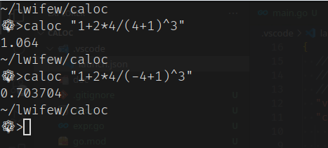
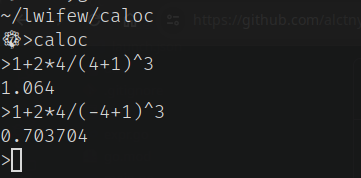

# 一个基于命令行的简易计算器

## 使用说明

通过 `caloc [expersion]` 传递一个表达式给 caloc，获得计算结果

你也可以不携带任何参数，通过 `caloc` 进入交互模式，然后在交互模式中进行运算

## 注意事项

如果直接计算传递一个表达式给 caloc，且表达式中包含括号，请使用引号将表达式包裹，不然括号会被当作特殊字符处理。

## TODO

[TODO List](./.todo)